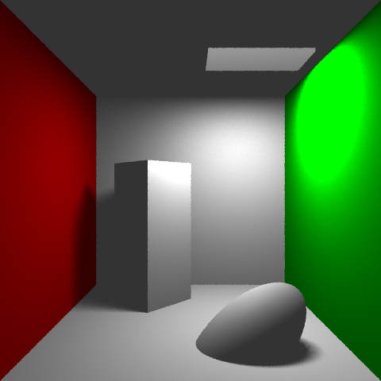

# RayTracing_Python
 Ray Tracing with Python: Slow to render. Fast to learn.

 Render Types:
 - Ray Tracing
 - Path Tracing (WIP)

 Features:
 - Transformations: Postion, Rotation, Scale
 - Shapes: Spheres, Boxes, Planes
 - Light Types: Point, Area

 

# How to run

## Inicialization local environment

```bash
pyenv local && pyenv install
python -m venv env
source env/bin/activate
pip install pip setuptools --upgrade
pip install -r requirements.txt
```

## Run

Run the following command and to get a *Image/output.png* file with the render.
```bash
python ./Source/main.py 
```


